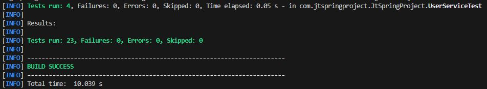

# Implementación de las pruebas

## Estado del proyecto

El proyecto actualmente no tiene ninguna prueba, debido a esto se va a implementar primero pruebas unitarias y luego en el proceso se abre la posibilidad de implementar pruebas de integración.

1. Pruebas unitarias: Las pruebas unitarias son fundamentales para cualquier proyecto de software. Prueban la funcionalidad a nivel de método o clase y ayudan a identificar y corregir errores temprano en el ciclo de desarrollo.
2. Pruebas de integración: Estas pruebas verifican que diferentes módulos o servicios en tu aplicación trabajen correctamente juntos.
3. Pruebas automatizadas: Automatizar tus pruebas puede ahorrar mucho tiempo y esfuerzo. Las pruebas automatizadas se pueden ejecutar como parte de tu proceso de integración continua.
4. Refactorización: Si tienes un código antiguo sin pruebas, puede ser útil refactorizar ese código y escribir pruebas para él. La refactorización puede hacer que el código sea más fácil de entender y probar.
5. Formación y cultura: Fomenta una cultura de pruebas en tu equipo. Asegúrate de que todos los miembros del equipo entienden la importancia de las pruebas y tienen la formación necesaria para escribir y ejecutar pruebas eficaces.

## Implementación

El primer gran problema presentado es hacer correr el proyecto con la finalidad de que la pruebas puedan ser ejecutadas. Para este caso primero me dio error al intentar correrlo ya que no logra conectarse a una base de datos.

### MariaDB

Estoy viendo otra materia llamada Sistemas de Gestión de Bases de Datos (SGBD), asi que utilice el motor de bases de datos 
[MariaDB](https://mariadb.org) ya que es uno de los motores que estoy analizando como proyecto en la materia. Este motor esta 
basado en SQL, es de codigo abierto y permite la importanción del archivo que nos ayuda a crear la base de datos.</br>

Para importar la base de datos podemos usar el archivo [basedata.sql](./JtProject/basedata.sql) el cual no crea la base de datos completa. Ahora debemos configurar el archivo [application.properties](./JtProject/src/main/resources/application.properties) y modificar lo siguiente:

```
db.driver= org.mariadb.jdbc.Driver
db.url= jdbc:mariadb://localhost:3306/ecommjava?createDatabaseIfNotExist=true
db.username= root
db.password= root
entitymanager.packagesToScan= com
```

Con eso ya logramos poder ejecutar las pruebas.

### Pruebas Unitarias

Por el momento voy a realizar unicamente pruebas unitaria comprobando los servicios y los controllers del proyecto.

Las clases que contienen esta pruebas estan dentro de la carpeta [test](./JtProject/src/test/java/com/jtspringproject/JtSpringProject/)

En estas clases valido mas que todo los metodos de las clases service. Acontinuacion un ejemplo de la ejecucion de las pruebas:</br>


Despues de haber implementado alguna pruebas unitarias ahora poodemos usar el comando:</br>

```
mvn test
```

Y asi obtenemos lo siguiente:</br>



## Mejoras Propuestas

Es necesario hacer pruebas de integracion que validen el correcto funcionamiento del proyecto, con la finalidad de empezar a refactorizar el codigo y empezar a validar
errores o posibles problemas cuando la refactorización del codigo sea realizada.